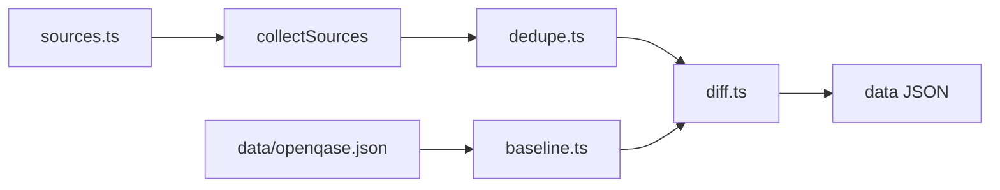

# quantum-landscape

Local scripts to survey the quantum open-source landscape and compare it to
[OpenQase](https://openqase.com).

## Capabilities

1. **`npm run fetch:openqase`** — pull published OpenQase software + case studies (anon API) → `data/openqase.json`
2. *(Planned)* **`npm run fetch:software`** — external software adapters → catalog + gap vs OpenQase
3. *(Planned)* **`npm run fetch:cases`** — external case adapters → catalog + gap vs OpenQase

Outputs are review lists by default. No writes to OpenQase.

## Setup

```bash
cp .env.example .env.local
# Fill OPENQASE_SUPABASE_URL + OPENQASE_SUPABASE_ANON_KEY (anon / publishable only)
npm install
npm run fetch:openqase
npm run fetch:software
npm run fetch:cases
```

## Content pipeline (software & cases)

Both domains follow the same steps. Only the entry type and match keys differ.

```
CLI (scripts/fetch-<domain>.ts)
  1. sources.ts          list external SourceAdapters
  2. collectSources()    each adapter.fetch() → concatenate
  3. dedupe.ts           collapse duplicates across sources
  4. baseline.ts         load OpenQase slice from data/openqase.json
  5. diff.ts             external vs baseline → gap report
  6. write data/         <domain>.json + <domain>-vs-openqase.json
```



| Step | Role |
|------|------|
| **Adapter** (`adapters/`) | External feed → domain entries |
| **Dedupe** | Merge among *external* sources (same GitHub / arXiv id) |
| **Baseline** | Map cached OpenQase rows → same entry shape |
| **Diff** | Gap report vs baseline |

`fetch:openqase` is separate: it refreshes the shared baseline file that every domain’s `baseline.ts` reads.

## Standard domain folder

Each content type under `src/<domain>/` should look like:

```
src/<domain>/
  sources.ts       # SourceAdapter<Entry>[] - list of feeds to read from
  adapters/        # one folder/file per external feed (fetch + parse)
  dedupe.ts        # Entry[] → Entry[] across sources - removes duplicates from collective feed output
  baseline.ts      # data/openqase.json → Entry[] - collects data obtained from fetch:openqase and formats them into Entry[]
  diff.ts          # (external, baseline) → gap report
  aliases.ts       # optional domain-specific key aliases
```

Shared pieces stay outside domains:

- `src/types/` — `SourceAdapter<T>`, `SoftwareEntry`, `CaseEntry`, `openqase.ts` (catalog DTOs), …
- `src/utils/` — `collectSources`, `slugify`, `resolveAlias`, env helpers
- `src/openqase/` — live fetch + read of `data/openqase.json`

## Layout

```
scripts/
  fetch-openqase.ts
  fetch-software.ts
  fetch-cases.ts
src/
  types/
  utils/
  openqase/
  software/
    sources.ts
    baseline.ts
    dedupe.ts
    diff.ts
    aliases.ts
    adapters/qosf/…
  cases/
    sources.ts
    baseline.ts
    dedupe.ts
    diff.ts
    aliases.ts
    adapters/arxiv.ts
data/
  openqase.json
  software.json
  software-vs-openqase.json
  cases.json
  cases-vs-openqase.json
```
